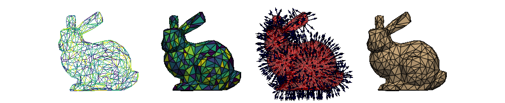

# **PolyMesh** - A Python Library for Compound Meshes with Jagged Topologies



[](https://circleci.com/gh/dewloosh/PolyMesh)
[](https://polymesh.readthedocs.io/en/latest/?badge=latest)
[](https://opensource.org/licenses/MIT)
[](https://pypi.org/project/PolyMesh)
[](https://www.python.org)
[](https://github.com/psf/black)

> **Warning**
> PolyMesh is in the early stages of it's lifetime, and some concepts may change in the future. If you want long-term stability, wait until version 1.0, which is planned to be released if the core concepts all seem to sit and the documentation covers all major concepts.

The [PolyMesh](https://PolyMesh.readthedocs.io/en/latest/) library aims to provide the tools to build and analyse meshes with complex topologies. Meshes can be built like a dictionary, using arbitarily nested layouts and then be translated to [VTK](https://vtk.org/) or [PyVista](https://docs.pyvista.org/). For plotting, there is also support for [K3D](http://k3d-jupyter.org/), [Matplotlib](https://matplotlib.org/) and [Plotly](https://plotly.com/python/).

The data model is built around [Awkward](https://awkward-array.org/doc/main/), which makes it possible to attach nested, variable-sized data to the points or the cells in a mesh, also providing interfaces to other popular libraries like [Pandas](https://vtk.org/) or [PyArrow](https://arrow.apache.org/docs/python/index.html). Implementations are fast as implementations rely on the vector math capabilities of [NumPy](https://numpy.org/doc/stable/index.html), while other computationally sensitive calculations are JIT-compiled using [Numba](https://numba.pydata.org/).

Here and there we also use [NetworkX](https://networkx.org/documentation/stable/index.html#), [SciPy](https://scipy.org/), [SymPy](https://www.sympy.org/en/index.html) and [scikit-learn](https://scikit-learn.org/stable/).

## Documentation

The [documentation](https://PolyMesh.readthedocs.io/en/latest/) is hosted on ReadTheDocs, where you can find more examples.

## Installation

PolyMesh can be installed from PyPI using `pip` on Python >= 3.7:

```console
>>> pip install polymesh
```

## Testing

```console
>>> python -m unittest
```

## License

This package is licensed under the MIT license.
