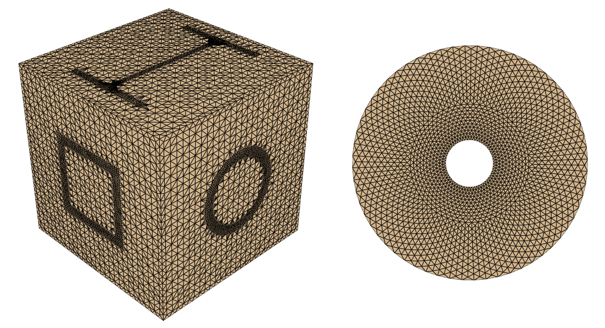

==============================================================================
PolyMesh - A Python Library for Compound Polygonal Meshes with Jagged Topology
==============================================================================

----

PolyMesh is an effort to provide an easy access to the most popular data
visualization libraries. It makes you able to

* build, manipulate and analyse meshes easily, then convert to other formats

* plot spatial data with the most popular backends such as Matplotlib, 
  Plotly, PyVista, Vedo, etc.

The library is built around the cornerstones of high performance computing 
in Python, such as `Numpy`, `Scipy`, `Awkward` and `Numba` and provides
a few 'numba-jittable' classes to handle pointclouds and polygonal meshes.

.. _user_guide:

.. toctree::
    :maxdepth: 3

    notebooks

.. toctree::
    :maxdepth: 2

    auto_examples/index.rst

.. toctree::
    :maxdepth: 2
   
    api
   
Indices and tables
------------------

* :ref:`genindex`
* :ref:`modindex`
* :ref:`search`

